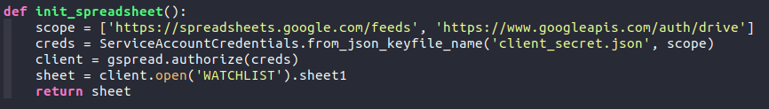

# watchlist_script
This is the repo of a script used to email me all the companies as they go on sale in my watchlist.

# Before starting
* Before starting send emails, there are some steps to take. The main workflow of this app is through google sheets. That said, I set the app with my personal google sheet where I will be putting my watchlist companies.

	

	This is using the **client_secret.json** file, which is given by Google's APIs when you create a proyect. Also, the line

	``` python
	sheet = client.open('WATCHLIST').sheet1
	```
	
	uses the name of my spreadsheet (WATCHLIST), change it to yours.

* An important step, as we are working sending SMTP messages from a 3er app provider (our computer), Google blocks all communication if we don't allow it. 

	
	
	As we are working with the google sheets api, we need to create a proyect in the google apis platform and share access to the spreadsheet to the mail provided by the api as you create the credentials.

* The script uses environment variables that I created in my .env environment. Include yours in the environment you are using (that has installed the requirements (**requirements.txt**)), or just change the following lines with your data.

	``` python
	MAIL_TO_ADDRESS = os.environ['MAIL_TO_ADDRESS']
	MAIL_SERVER = os.environ['MAIL_SERVER']
	MAIL_FROM_ADDRESS = os.environ['MAIL_FROM_ADDRESS']
	MAIL_FROM_PASSWORD = os.environ['MAIL_FROM_PASSWORD']
	```


# Usage
This app is useful if we are working with a spreadsheet already, or we are willing to create a new one, as it gets the values of the spreadsheet and emails you if the company's buyprices is higher or equal than the current close price. Example of spreadsheet:


# Installation
Just clone this repo and run the **program.py** file inside the virtual environment created with venv. I recommend setting up a way for the program to run in the background as you log in your computer, it will just email you at the right times.

